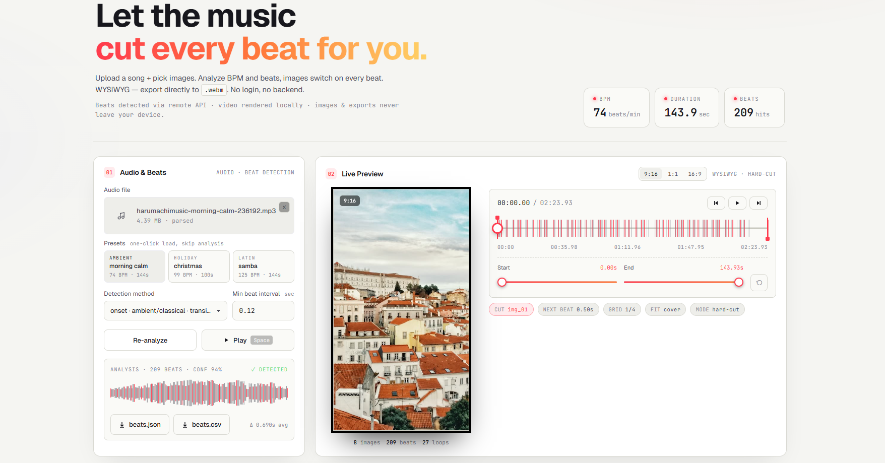

# Beatflow

> **The open-source, in-browser beat-cut video generator — no login, no upload, 100% local render.**
>
> 开源、浏览器内运行的 AI 卡点视频生成器 —— 无需注册、无需上传、本地渲染导出。

<p align="center">
  <a href="https://future-insight.github.io/beatflow/"></a>
  <a href="https://github.com/Future-Insight/beatflow/stargazers"></a>
  <a href="https://github.com/Future-Insight/beatflow/network/members"></a>
  <a href="https://github.com/Future-Insight/beatflow/issues"></a>
  <a href="./LICENSE"></a>
  
  
</p>

[](https://future-insight.github.io/beatflow/)

<p align="center">
  <a href="https://future-insight.github.io/beatflow/">
    <strong>🎬 Try it live / 立即体验 →&nbsp;&nbsp;https://future-insight.github.io/beatflow/</strong>
  </a>
</p>

---

## Why Beatflow?

|                       | Beatflow       | CapCut / Premiere beat-sync | Generic AI video tools |
| --------------------- | -------------- | --------------------------- | ---------------------- |
| Runs in browser       | ✅ zero install | ❌ desktop app               | ⚠️ cloud-only           |
| Your images leave?    | ❌ never        | depends                     | ✅ uploaded             |
| Beat-accurate cutting | ✅ frame-level  | ✅                           | ⚠️ loose sync           |
| Open source           | ✅ MIT          | ❌ proprietary               | ❌                      |
| Login required        | ❌              | ⚠️                           | ✅                      |

**Built for:** independent musicians sharing singles, AI-art creators turning Midjourney / 可灵 / 即梦 outputs into short-form video, and indie creators who don't want to upload their WIP to a SaaS.

---

## English

Beatflow is an in-browser beat-cut video generator: upload a song + pick images, the app detects BPM and beat timestamps, cuts images on every beat, and exports a ready-to-share `.webm` / `.mp4` video — WYSIWYG, no login, no backend required for rendering.

- 🎧 **Automatic beat detection** — `beat` mode (pop / dance, downbeats) / `onset` mode (ambient / classical, transients)
- 🖼️ **Image cutting** — drag-to-reorder thumbnails, fixed or random playback, switch per beat
- 🎬 **Live preview** — 9:16 / 1:1 / 16:9 aspects, WYSIWYG stage
- 💾 **Local export** — rendered and exported in-browser, nothing uploaded
- 🔒 **Privacy-first** — only beat analysis hits the API; images & exports never leave your device
- 🌗 **Bilingual & theming** — 中文 / English, dark / light, one-click toggle

### Live demo

👉 **[https://future-insight.github.io/beatflow/](https://future-insight.github.io/beatflow/)**

No signup, no install — just open and go.

### Project layout

- `frontend/` — static frontend, deploys to GitHub Pages / Cloudflare Pages / Vercel
- `api/` — Flask beat-analysis service (Docker / Fly.io friendly)

### Run locally

**Beat-analysis API:**

```bash
cd api
python3 -m venv venv
source venv/bin/activate
pip install -r requirements.txt
PORT=8088 python app.py
```

Health check: `curl http://localhost:8088/api/health`

Analyze endpoint:

```bash
curl -F "audio=@your.mp3" -F "method=beat" -F "min_interval=0.3" \
     http://localhost:8088/api/analyze
```

**Frontend:**

```bash
cd frontend
python3 -m http.server 5173
```

Then open `http://localhost:5173/`.

---

## 中文简介

### 它解决什么问题？

- 剪映 / PR 的卡点要手动踩点，**累**
- 云端 AI 视频工具要**上传图片 + 注册 + 跑额度**
- 开源工具大多是命令行、没前端、不能所见即所得

**Beatflow 把这三件事合成一件：** 浏览器打开 → 丢音乐 + 图 → 自动踩点 → 所见即所得 → 一键导出。全程图片不离开你的电脑。

### 适合谁用

- 🎵 **独立音乐人**：新歌出封面 / TikTok / 小红书引流视频
- 🎨 **AI 绘画创作者**：把 Midjourney / 可灵 / 即梦 的出图变成卡点短视频
- 📱 **短视频博主**：批量做 9:16 卡点，不想把素材上传到任何 SaaS
- 🛠 **独立开发者**：想要个能自托管、纯前端、可魔改的卡点方案

### 正文介绍

Beatflow 是一款浏览器端的自动节拍卡点视频生成器：上传一首音乐 + 一组图片，系统自动检测节拍 BPM 与强拍时间点，图片按节拍切换，所见即所得，直接导出 `.webm` / `.mp4` 卡点短视频。

- 🎧 **自动节拍检测** —— `beat` 模式（流行/电子，强拍定位） / `onset` 模式（氛围/古典，能量突变）
- 🖼️ **图片卡点** —— 支持拖拽排序、固定 / 随机播放，图片在每个节拍点切换
- 🎬 **实时预览** —— 9:16 / 1:1 / 16:9 三种比例，所见即所得
- 💾 **本地导出** —— 视频在浏览器内渲染并导出，不上传不登录
- 🔒 **隐私优先** —— 仅节拍分析走 API，图片与导出永不离开设备
- 🌗 **双语 & 明暗主题** —— 中文 / English，深色 / 浅色一键切换

### 在线体验

👉 **[https://future-insight.github.io/beatflow/](https://future-insight.github.io/beatflow/)**

无需注册、无需下载，浏览器打开即用。

### 项目组成

- `frontend/` — 纯静态前端（可直接部署到 GitHub Pages / Cloudflare Pages / Vercel）
- `api/` — Flask 节拍分析服务（Docker / Fly.io 友好）

### 本地运行

**启动节拍分析 API：**

```bash
cd api
python3 -m venv venv
source venv/bin/activate
pip install -r requirements.txt
PORT=8088 python app.py
```

健康检查：`curl http://localhost:8088/api/health`

**启动前端：**

```bash
cd frontend
python3 -m http.server 5173
```

浏览器打开 `http://localhost:5173/` 即可。

---

## Star History

[](https://star-history.com/#Future-Insight/beatflow&Date)

If Beatflow saved you an afternoon of manual beat-tagging (踩点), a ⭐ would mean a lot — it's the only metric indie devs have.

---

## Credits & 关键词

Beat detection powered by [librosa](https://librosa.org/) · in-browser rendering via WebCodecs + Canvas · static frontend hosted on GitHub Pages.

<sub>Keywords: AI video generator, beat sync, 卡点视频, music video automation, browser video editor, open source CapCut alternative, Midjourney to video, Suno visualizer, 可灵 / 即梦 / 抖音 / 小红书 视频生成</sub>
